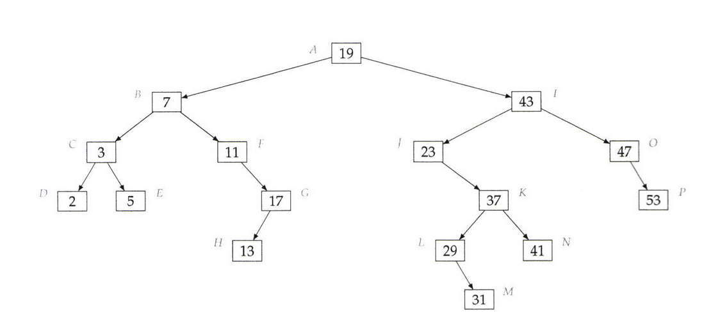

# Compute The LCA In A BST

 

Write a program that takes as input a BST and an integer k, and retums the k largest elements in the BST in decreasing order.

### Example 1
Input: tree, k = 3
Output: [53, 47, 43]

 

### Example 2
Input: tree, k = 2
Output: [53, 47]

 

