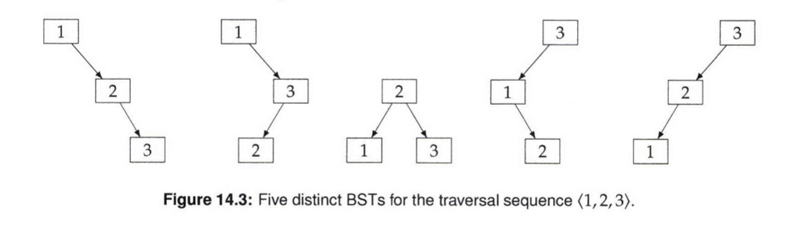

# Build A Minimum Height BST From A Sorted Array

 
Given a sorted array, the number of BSTs that can be built on the entries in the array grows enormously with its size. 
Some of these trees are skewed, and are closer to lists; others are more balanced. 
How would you build a BST of minimum possible height from a sorted array?

 

- Hint; Which element should be the root?

 
From the figure above, given a sorted array [1,2,3], the tree with the minimum height is the third tree

