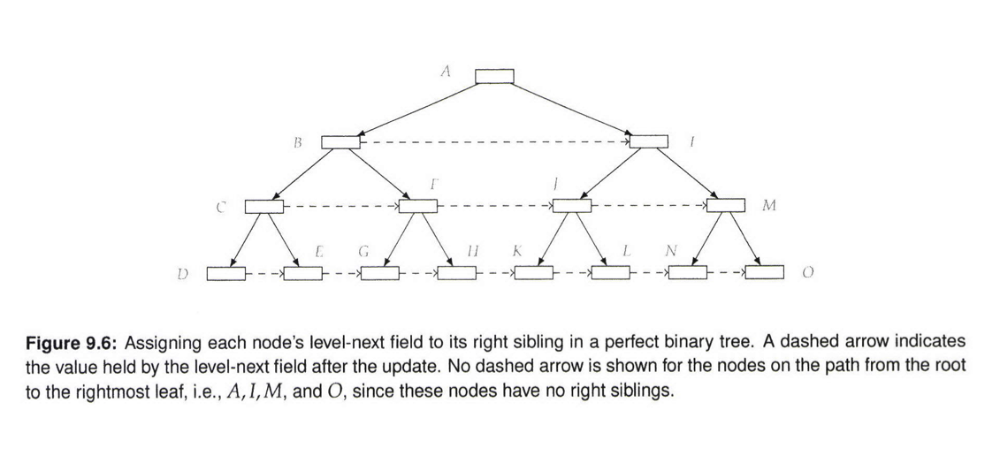

# Compute The Right Sibling Tree

* Write a program that takes a perfect binary tree, and sets each node's level-next field to the node on its right, if one exists.

* Note - A perfect binary tree is a full binary tree in which all leaves are at the same depth, and in which every parent has two children.

