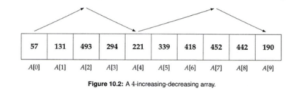

# Sort An Increasing Decreasing Array

Design an efficient algorithm for sorting a k-increasing-decreasing array. 

 

- An array is said to be k-increasing-decreasing if elements repeatedly increase up to a certain index after which they decrease, 
then again increase, a total of k times. This is illustrated in Figure below

 

 
 

### Example 1
- input:  [57, 131, 493, 221, 294, 339, 418, 452, 190, 442]
- output: [0, 0, 3, 5, 5, 6, 7, 28]

