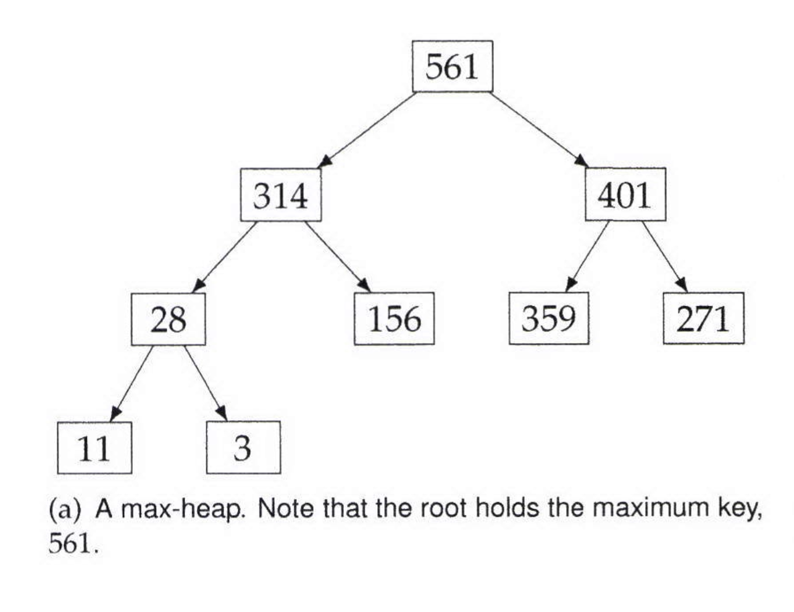
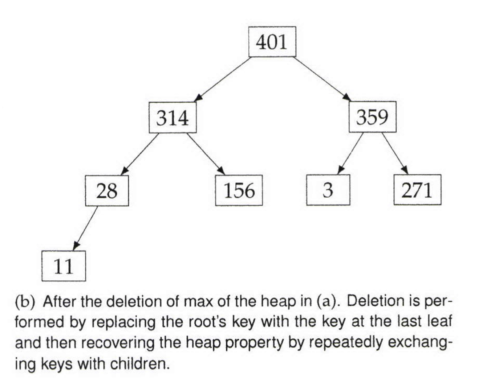

# Heaps

A heap is a specialized binary tree. Specifically, it is a complete binary tree. A heap is sometimes referred to as a priority queue because it behaves like a queue, with one difference: each element has a "ptiority" associated with it, and deletion removes the element with the highest priority.
There are two types of heaps: a max heap and a min heap.

 

## Max Heap

For heap to be considered a max heap the keys must satisfy the heap property which is the key at each node is at least as greater or equal to the keys stored at its children. 
The figure below shows an example of a max heap. A max-heap can be implemented as an array; the children of the node at index i are at indices 2i + 1 and 2i + 2.
The array representation for the max-heap in Figure below is [561,314,401,28,156,359,271,11,3].

 

 
 

A max-heap supports O(Logn) insertions, O(1) time lookup for the max element, and O(logn) deletion of the max element. The extract-max operation is defined to delete and return the maximum element. See figure below for an example of deletion of the max element. Searching for arbitrary keys has O(n) time complexity.

 

 
 

## Min Heap

For heap to be considered a min heap the keys must satisfy the heap property which is the key at each node is at lesser than or equal the keys stored at its children.
A min-heap supports O(Logn) insertions, O(1) time lookup for the minimum element, and O(logn) deletion of the min element. The extract-min operation is defined to delete and return the minimum element. The figure below shows an example of a min heap.

 

 
 

## Know Your Heap Libraries

Heap functionality in Python is provided by the heapq module. The operations and functions we will use are
- heapq.heapify(L), which transforms the elements in L into a heap in-place,
- heapq.nlargest(k, L) returns the k largest elements in L,
- heapq.nsmallest(k, L) returns the k smallest elements in L,
- heapq. heappush(h, e), which pushes a new element on the heap,
- heapq.heappop(h), which pops the smallest element from the heap,
- heapq.heappushpop(h, a), which pushes a on the heap and then pops and returns the smallest element
- e = h[0], which returns the smallest element on the heap without popping it.

 

## Note

- It's very important to remember that heapq only provides min-heap functionality. If you need to build a max-heap on integers or floats, insert their negative to get the effect of a max-heap using heapq

- For objects, implement __1tO__ appropriately

 

## Tips

- Use a heap you care about is the largest and smallest, and you don't need to support fast lookup, delete, or search operations for arbitrary elements

- A heap is a good choice when you need to compute the k largest or k smallest elements in a colleclion. For the former, use l min-heapp, for the latter use a max heap.

 
 
 

## Questions

In this section we will solve common heap questions that will help you understand the data structure very well. This will in turn give you the ability to solve other heap questions.

- [Merge Sorted Arrays](1_merge_sorted_arrays/merge_sorted_arrays.py)
- [Sort An Increasing Decreasing Array](2_sort_increasing_decreasing_array/sort_k_inc_dec_array.py)
- [Sort An Almost Sorted Array](3_sort_almost_sorted_array/sort_approximately_sorted_array.py)
- [Compute the K closest Stars](4_compute_k_closest_stars/k_closest_stars.py)
- [Compute Median From A Stream](5_compute_median_from_a_stream/compute_median.py)
- [K Largest Elements In A Max Heap](6_k_largest_elements_in_a_heap/k_largest_elements.py)
    - [K Largest Elements In A Max Heap - Solution 2](6_k_largest_elements_in_a_heap/k_largest_elements_1.py)
