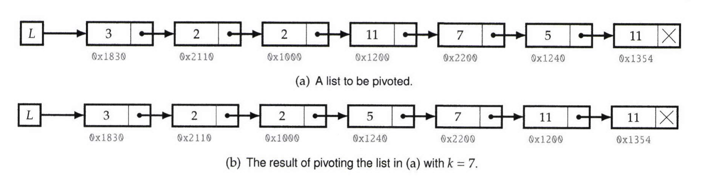

# Implement List Pivoting

Implement a function which takes as input a singly linked list and an integer k and performs a pivot of the list with respect to k. The relative ordering of nodes that appear before k, and after k, must remain unchanged; the same must hold for nodes holding keys equal to k.

  

