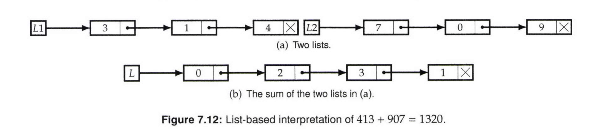

# Add Two LinkedLists

Write a program which takes two singly linked lists of digits, and returns the list corresponding to the sum of the integers they represent. The least significant digit comes first.

  

