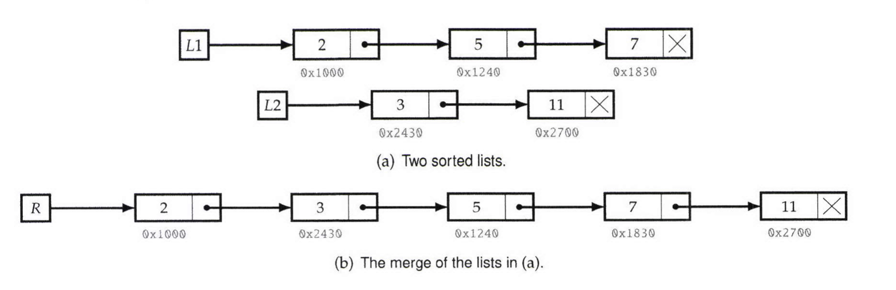

# Merge Two Sorted Lists

Consider two singly linked lists in which each node holds a number. Assume the lists are sorted, i.e., numbers in the lists appear in ascending order within each list.   
The *merge* of the two lists is a list consisting of the nodes of the two lists in which numbers appear in ascending order. Merge is illustrated in Figure below.  

Write a program that takes two lists, assumed to be sorted, and returns their merge. The only field your program can change in a node is its next field.  

- *Hint*: Two sorted arrays can be merged using two indices. For lists, take care when one iterator reaches the end.

  

