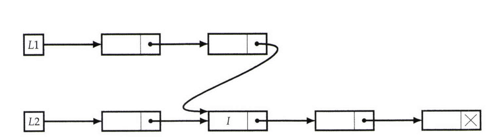

# Test For Overlapping List - Lists Are Cycle Free

Given two singly linked lists there may be list nodes that are common to both. (This may not be a bug-it may be desirable from the perspective of reducing memory footprint, as in the flyweight pattern, or maintaining a canonical form).   
For example, the lists in Figure below overlap at Node I.  

- Write a Program that takes two cycle-free singly linked lists, and determines if there exists a node that is common to both lists.

  

