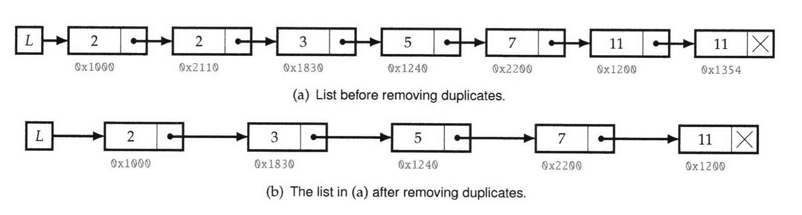

# Remove Duplicates From Sorted Lists

Write a program that takes as input a singly linked list of integers in sorted order, and removes duplicates from it. The list should be sorted.  
See example below:

