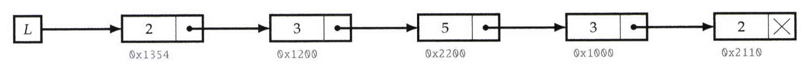
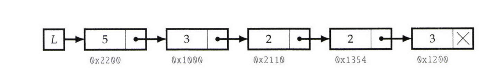

# Implement Cyclic Right Shift For Singly LinkedList

Write a program that takes as input a singly linked list and a nonnegative integer k, and retums the list cyclically shifted to the right by k.  
See example below after shifting linkedlist 2 times (k=2):  
  

## Before Cyclic Shift    
 

    
  

## After Cyclic Shift    
 

