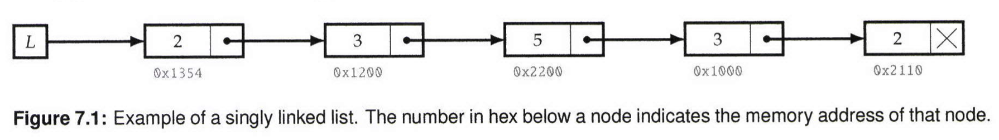
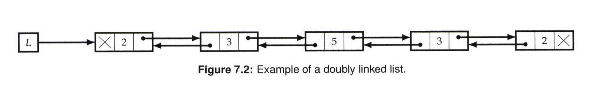

# LinkedLists

A list implements an ordered collection of values, which may include repetitions. Sepcifically, a singly linked list is a data structure that 
contains a sequence of nodes such that each node contains an object and a reference to the next node in the list.   
The first node is referred to as the head and the last node is referred to as the tail; the tail's next field is null.
There are many variants of linked lists, e.g, tn a doubly linked list, each node has a link to its predecessor;

<br>


A list is similar to an array in that it contains objects in a linear order. 
The key differences are that inserting and deleting elements in a list has time complexity O(1).   
On the other hand, obtaining the kth element in a list is expensive, having O(n) time complexity.
Lists are usually building blocks of more complex data structures.  
Below are examples of a singly linkedlist and a doubly linkedlist.

<br>



<br>
<br>



<br>
<br>

For all problems in this section, unless otherwise stated, each node has two entries 
- a data field, and a next field, which points to the next node in the list, with the next field of the last node being null.   
Its prototype is as follows:   

```

  class ListNode:
    def __init__(self , data=0, next-node=None)
      self.data = data self.next = next-node

```   


## LinkedList Bootcamp
There are two types of list-related problems  
- those where you have to implement your own list, 
- and those where you have to exploit the standard list library.  
We will review both these aspects here, starting with implementation.

Implementing a basic list APl-search, insert, delete-for singly linked lists is an excellent way to become comfortable with lists.

### Search for a key
```
  def search_list (L, key): 
    while L and L.data != key
      L = L. next

    # If key was not present in the List, L will have become null 
    return L
```  

### Insert a new node after a specified node
```

  # Insert new_node after node. 
  def insert_after(node, new_node):
    new_node.next = node.next 
    node.next = new_node

```

### Delete a node:
```
  
  def delete_node(node):
    node = node.next


  #Delete the node past this one. Assume node is not a tail
  def delete_after(node):
    node.next = node.next.next

```

<br><br>

## Top Tips

-  List problems often have a brute force that uses O(n) space, but a subtler solution that uses the existing list nodes to reduce space complexity to O(1)

- Very often, a problem on lists is conceptually simple, and is more about cleanly coding what's specified, rather than designing an algorithm.

- Consider using a dummy head (sometimes referred to as a sentinel) to avoid having to check for empty lists. This simplifies code, and makes bugs less likely.

- It's easy to forget to update next (and previous for double linked list) for the head and tail.

- Algorithms operating on singly linked lists often benefit from using two iterators, one ahead of the otheq, or one advancing quicker than the other.


<br> <br>

## Questions

In this section we will solve common linkedlist questions that will help you understand the data structure very well. This will in turn give you the ability to solve other linkedlist questions

- [Merge Two Sorted Lists](1_merge_two_sorted_lists/merge_two_list.py)
- [Merge Two Sorted Doubly LinkedList](1.1_merge_two_sorted_doubly_linkedlist/merge_list.py)
- [Reverse A Sublist](2_reverse_a_single_sublist/reverse_sublist_1.py)
  - [Reverse A Sublist - Solution 2](2_reverse_a_single_sublist/reverse_sublist_2.py)
  - [Reverse A Singly LinkedList](2.1_reverse_singly_linkedlist/reverse_singly_linkedlist.py)
<!-- - [Reverse Every K Sublist](2.2_reverse_every_k_sublist/reverse_k_sublist.py) --> -->
- [Test For Cyclicity](3_test_for_cyclicity/has_cycle.py)
- [Find The Start Of A Cycle In A LInkedList](3.1_start_of_linkedlist_cycle/find_cycle_start_1.py)
  - [Find The Start Of A Cycle In A LInkedList - Solution 2](3.1_start_of_linkedlist_cycle/find_cycle_start_2.py)
- [Test For Overlapping List - Lists Are Cycle Free](4_test_for_overlapping_lists/has_overlapping_list.py)
<!-- - [Test For Overlapping List - Lists May Have Cycles](4_test_for_overlapping_lists/has_overlapping_list.py) -->
- [Delete Node From Singly Linkedlist](6_delete_node_from_singly_linkedlist/delete_node.py)
- [Remove Kth Last Element From List](7_remove_kth_last_element_from_list/remove_kth_last_element.py)
- [Remove Duplicates From Sorted Lists](8_remove_duplicates_from_sorted_list/remove_duplicates.py)
- [Implement Cyclic Right Shift For Singly LinkedList](9_cyclic_right_shift_of_singly_linkedlist/cyclic_right_shift_list.py)
- [Even Odd Merge](10_even_odd_merge/even_odd_merge.py)
- [Test If Singly LinkedList Is Palindromic](11_palindromic_linkedlist/is_palindrome.py)
- [Implement List Pivoting](12_implement_list_pivoting/list_pivoting.py)
- [Add Two LinkedLists](13_add_two_linkedlists/add_lists.py)
