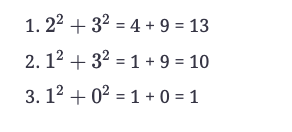

# Happy Number (medium) ✩

Any number will be called a happy number if, after repeatedly replacing it with 
a number equal to the sum of the square of all of its digits, leads us to number ‘1’. 
All other (not-happy) numbers will never reach ‘1’. 
Instead, they will be stuck in a cycle of numbers which does not include ‘1’.

#### Example 1
Input: 23   
Output: true (23 is a happy number)  
Explanations: Here are the steps to find out that 23 is a happy number:

#### Example 2
Input: 12   
Output: false (12 is not a happy number)  
Explanations: Here are the steps to find out that 12 is not a happy number:

