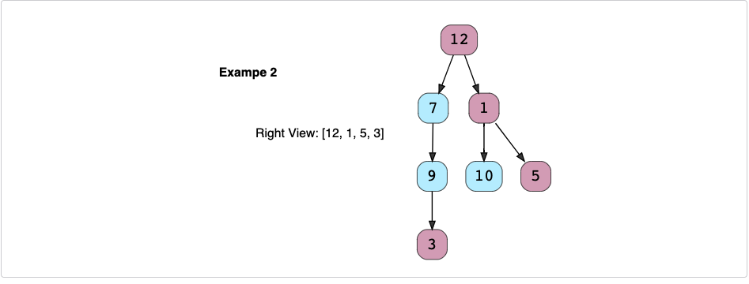

# Right View of a Binary Tree (easy)✩

Given a binary tree, return an array containing nodes in its right view. 
The right view of a binary tree is the set of nodes visible when the tree is seen from the right side.

