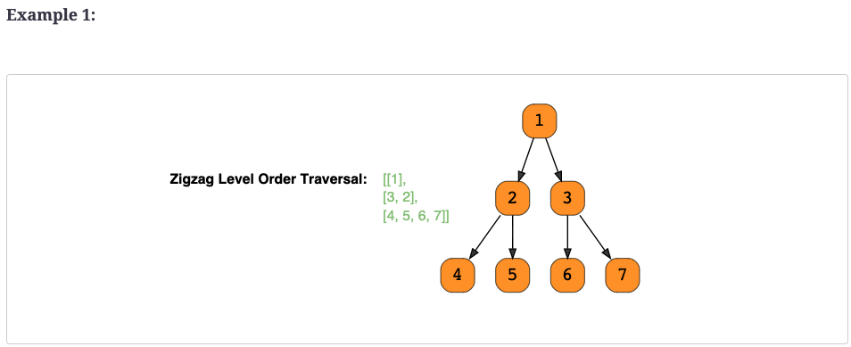

# Zigzag Traversal (medium) ✩

Given a binary tree, populate an array to represent its zigzag level order traversal. 
You should populate the values of all nodes of the first level from left to right, 
then right to left for the next level and keep alternating in the same manner for the following levels.

