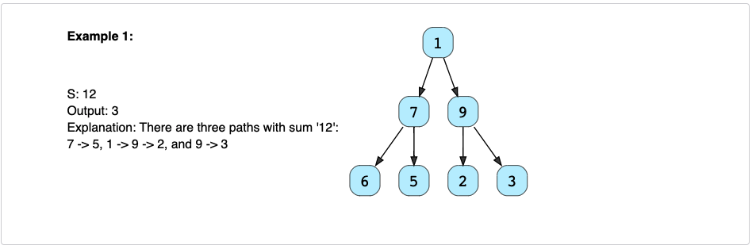
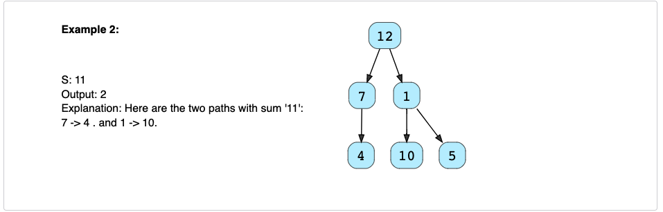

# Count Paths for a Sum (medium)✩

Given a binary tree and a number ‘S’, find all paths in the tree such that 
the sum of all the node values of each path equals ‘S’. Please note that the 
paths can start or end at any node but all paths must follow direction 
from parent to child (top to bottom).

