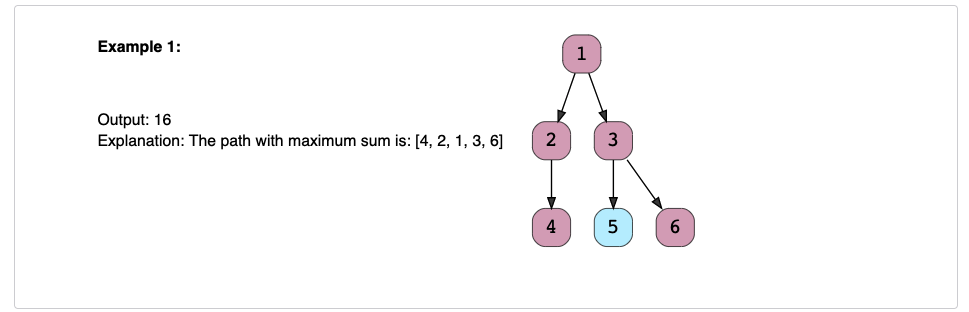

# Path With Maximum Sum (Hard)✩

Find the path with the maximum sum in a given binary tree. 
Write a function that returns the maximum sum.

A path can be defined as a sequence of nodes between any two nodes 
and doesn’t necessarily pass through the root. The path must contain at least one node.

