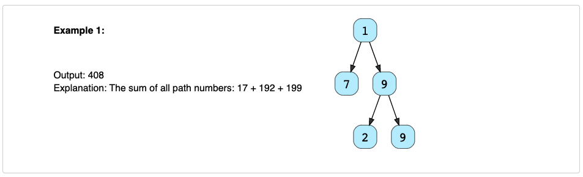

# Sum of Path Numbers (medium)✩

Given a binary tree where each node can only have a digit (0-9) value, 
each root-to-leaf path will represent a number. 
Find the total sum of all the numbers represented by all paths.

