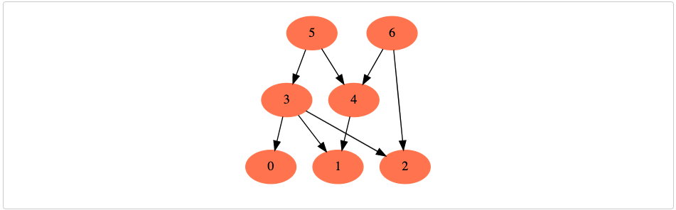

# Topological Sort (medium) ✩

Topological Sort of a directed graph (a graph with unidirectional edges) is a linear ordering 
of its vertices such that for every directed edge (U, V) from vertex U to vertex V, U comes before V in the ordering.

Given a directed graph, find the topological ordering of its vertices.

### Example 1
Input: Vertices=4, Edges=[3, 2], [3, 0], [2, 0], [2, 1]
Output: Following are the two valid topological sorts for the given graph:
1) 3, 2, 0, 1
2) 3, 2, 1, 0

### Example 2
Input: Vertices=4, Edges=[3, 2], [3, 0], [2, 0], [2, 1]
Output: Following are the two valid topological sorts for the given graph:
1) 3, 2, 0, 1
2) 3, 2, 1, 0

### Example 3
Input: Vertices=4, Edges=[3, 2], [3, 0], [2, 0], [2, 1]
Output: Following are the two valid topological sorts for the given graph:
1) 3, 2, 0, 1
2) 3, 2, 1, 0

